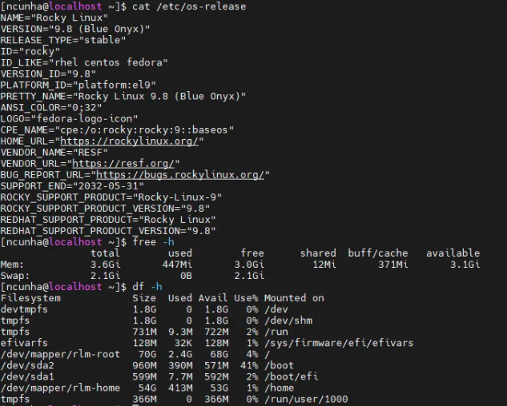
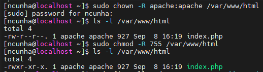
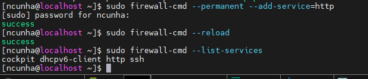
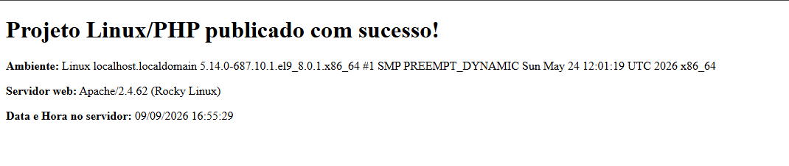

# LABORATÓRIO: Publicar uma Aplicação PHP em uma VM 
Essa é a documentação do exercício prático de infraestrutura Linux. Foi imposta como um desafio no primeiro mês que comecei como treinee.

## Objetivo 
O objetivo porposto era subir uma máquina virtual Linux, preparar um ambiente web, disponibilizar uma aplicação PHP escrita do zero e confirmar que a página esteja acessível no navegador - Ao decorrer do projeto foi praticado os conceitos de sistema operacional, instalação de serviços, as permissões, processamento de PHP e as requisições HTTP. 

## Ambiente utilizado 
| Item | Detalhe |
|---|---|
| Sistema operacional | Rocky Linux 9.8 (Blue Onyx) |
| Web server | Apache (httpd) 2.4.62 |
| Processador PHP | PHP-FPM |
| Firewall | firewalld |

## O que foi feito 
1. O primeiro passo realizado foi a **Conexão da VM através do SSH**, fazendo a verificação das suas configurações também através dos comandos abaixo

| Comando | Detalhe |
|---|---|
| cat /etc/os-release | Utilizado para confirmar se os pacotes e comandos usados seriam compativeis na nossa máquina |
| free -h | Utilizado para passar informações sobre a memória RAM do sistema|
| df -h | Utilizado para mostar o espaço em disco de cada partição montada |

2. O segundo passo foi realizar a instalação do Apache e do PHP através do comando **dnf install httpd php -y**, incluindo o PHP-FPM como um processador do PHP.

3. O terceiro passo foi fazer a ativação dos serviços (httpd e php-fpm) com os comandos abaixo, fazendo com que o **httpd e php-fpm** iniciem junto com o sistema.

| Comando | Detalhe |
|---|---|
| systemctl start | Utilizado para iniciar um serviço imediatamente |
| systemctl enable | Utilizado para ativar a função que fará o serviço iniciar automaticamente |

O teste foi feito após a ativação e foi visto que realmente passou a ser iniciado automáticamente. 

4. O quarto passo foi realizar a **criação do index.php**, onde deveriamos exibir de forma dinâmica: 
    - O ambiente Servidor, utilizando a função **php_uname()**.
    - O software do Servidor web **$_SERVER['SERVER_SOFTWARE']**.
    - A data e a hora geradas no servidor no momento que for feita a requisição **date()**.

| Comando | Detalhe |
|---|---|
| php_uname() | Função usada para retornar as insformações sobre o sistema operacional onde o PHP está rodando |
| $_SERVER['SERVER_SOFTWARE'] | É uma variável especial do PHP chamada *superglobal*, nos devolve informações sobre a requisição e o próprio servidor a chave 'SERVER_SOFTWARE' traz o nome e a versão do software que está servindo a página |
| date() | Utilizado para retornar a data e a hora de acordo com a forma que é informado |

5. O quinto passo foi o ajuste das permissões dos arquivos através dos comandos **chown apache:apache**, **chmod 755** para que o apache possa ler o conteúdo publicado.

| Comando | Detalhe |
|---|---|
| chown apache:apache | chown (*change owner*) muda o dono e o grupo de um arquivo ou pasta, nesse caso foi transferido a posse de /var/www/html para o usuário apache|
| chmod 755 | Define as permissões de leitura, escrita e execução para três grupos: dono, grupo e outros 7 (dono) 5 (grupo) 5 (outros) |

6. O sexto passo foi realizar a **liberação da porta HTTP (80)** no firewall com o comando **firewall-cmd --add-service=http**

| Comando | Detalhe |
|---|---|
| firewall-cmd --add-service=http | Esse comando libera a porta 80 (usada pelo protocolo HTTP) no firewall da VM, usando o perfil de serviço pré configurado chamado http (sem essa liberação mesmo com o Apache rodando corretamente, o firewall iria bloquear por padrão tudo o que não é permitido)|

7. No sétimo passo foi realizado a validação no navegador, confirmando a mensagem inserida e os dados dinâmicos.

## Caminho da Requisição 
**Navegador  →  Porta 80 (firewall)  →  Apache (httpd)  →  PHP-FPM  →  index.php  →  HTML gerado  →  Navegador**

A requisição segue sempre um caminho fixo para termos o resultado esperado, primeiro o navegador deve acessar **http://< IP-da-VM >/index.php**, após isso o Apache vai identificar o arquívo PHP e ira encaminhar a execução para o gerenciador de processos (PHP-FPM), responsável por executar/interpretar o código PHP. O PHP-FPM vai processar o código e gerar o HTML puro comoo resultado e devolve ao Apache, que por fim vai enviar a resposta ao navegador. 

## Conceitos Praticados 

Foi escolhido o **Rocky Linux** é uma distribuição da RHEL (Red Hat Entrerprise Linux), possui código aberto mas mantém sua compatibilidade com a RHEL, foi instruido pelos gestores e adotei ela para proseeguir com a VM. 

O **Apache** foi escolhido pois é um pouco mais simples e possui bastante documentação o que ajuda caso surjam dúvidas, foi mais simples para realizar o processamento do PHP pois a integração entre o servidor web e o PHP-FPM vem configurada automaticamente ao instalar o pacote php no Rocky.